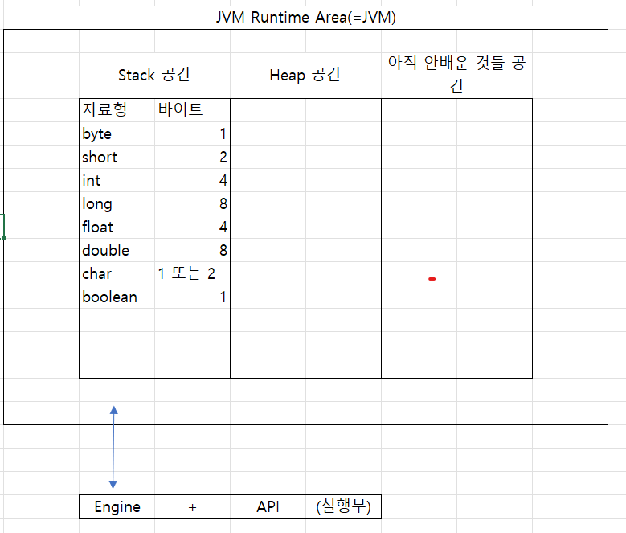
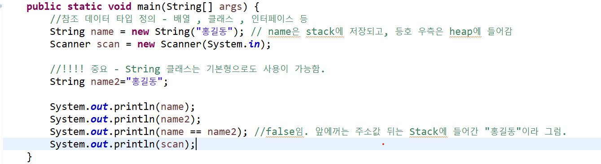

오늘은 변수와 자료형에 관한 수업이 진행되었다.

저장 공간과 관련된 사진을 아래 첨부한다.

특징

- 변수의 범위는 “선언”한 위치를 기준으로 해당 블록 내에서 적용된다.
- 전역변수(main에서 쓰려면 static으로 통일해야함)와 지역변수(main을 포함한 메소드들)를 배웠다.
- Stack공간 : 저장되는 변수는 선언된 블록이 끝나는 순간 전부 지워진다.
- Heap 공간 : 저장되는 변수가 선언된 블록이 끝나도 사라지진 않으나, Heap 공간에 저장된 데이터의 주소가 Stack에 저장되었다가 블록 끝나면 날라가므로 재사용 불가. 이렇게 쌓인 데이터는 나중에 Garbage collector가 모아서 삭제.

순서

1. 자바에서의 자료형
    1. 기본형(Primitive Type) : JVM Runtime Area(=JVM)의 Stack 공간에 저장.
        - 정수형 : byte/short/int/long
        - 실수형 : float/double
        - 논리형 : boolean
        - 문자형 : char
            - 특이 사항으로는 long과 float의 경우 헤깔리지 않기 위해
            - long L = 1000L;
            - float F = 1.785f; 이런식으로 표시할 수 있다.
    2. 참조형(Reference Type) : JVM Runtime Area(=JVM)의 Heap 공간에 저장.
        - 배열(Array), 클래스(Class), 인터페이스(Interface) 등이 있다.
2. 변수
    1. 변수란 데이터를 저장하는 공간으로 선언 형식은 아래와 같다.
        1. (자료형) (변수명) = (데이터);
    2. 변수명 정의시 유의사항 
        - 변수명은 알파벳(대소문자), 숫자, 특수문자(_,$), 한글 사용 가능.
        - 첫 글자는 숫자를 쓰면 에러남
        - 공백 사용 불가
        - 대소문자 구분 필수.
        - 예역어(키워드 - 자바에서 이미 선언한 단어들)은 사용 불가.
        - 변수명은 의미를 가지고 있는 것이 좋다.
        - 카멜케이스 쓰면 좋다.
3. 상수
    1. 항상 같은 값을 가지는 변수를 의미하며, 상수를 저장하는 변수명은 모든 글자를 대문자로 정의하는 것을 권장한다.
4. 변수 선언
    1. 자료형 변수명 = 데이터; 가 기본
        - 정수형 : int a = 1;
        - 실수형 : double b = 1.7;
        - 논리형 : boolean flag = true;
        - 문자형 : char name = ‘홍’; 이때 char은 1바이트이므로 1글자만 가능하며 반드시 그냥 따옴표로 묶을것.
    2. 참조 데이터 타입 변수 선언 : 자료형 변수명 = new 생성자();
        - String name = new String(”홍길동”); 단, String은 기본형으로도 생성 가능
        - String name = “홍길동”;
        
        위에서 말한대로 기본형(Stack에 전부 저장)으로 생성한 것과 Heap에 저장되는 것(Stack 에는 heap 주소만 저장됨)은 비교해보면 차이가 남을 알 수 있다.(아래 사진)
        
       
               - Scammer scan = new Scanner(System.in); - String은 java.lang 라이브러리에 있어서 기본으로  포함되지만 Scanner은 java.lang이 아닌 java.util.Scanner에 있어서 이걸 import 해줘야 쓸 수 있다.
            - 이는 scan이라는 변수를 선언한 것일뿐, 실제 사용은
            - String name = scan.next(); 또는int age = scan.nextInt();와 같이 사용한다.
5. 형변환(Type Castig)
    1. 기본 데이터 타입 형변환
        1. 자동(=묵시적) 형변환 : 작은 데이터 타입을 큰 데이터 타입에 넣는 경우
            - byte bdata =1;
            - short sdata = bdata;
            - 주의사항 ; char은 말이 문자열이지 사실 아스키 코드를 문자로 바꿔주는 것이다. 그래서 char>int로 형변환 하면 숫자가 튀어나오니 조심.
                - char c=’a’
                - int c_asc = c;
                - System.out.println(c_asc); 하면 65 나온다.
        2. 강제(=명시적) 형변환 : 큰 데이터 타입을 작은 데이터 타입에 넣는 경우. 데이터 손실이 발생할 수 있음.
            1. double ddata = 10000.258585;
            2. int idata = (int)ddata;
6. 제어문자
    1. 역슬래시(\ 또는 한국 원 표시)를 의미하며 아래와 같이 사용
        1. 개행문자 = \n
        2. 탭 문자 = \t
        3. 문자열 안에 쌍따옴표나 그냥 따옴표 = \” // \’